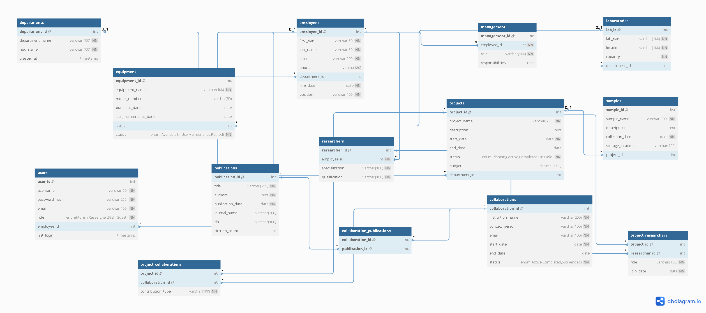

# 🔬 Krystal Research Lab Management System

## 📋 Overview
Krystal Research Lab Management System is a comprehensive database solution designed to streamline and manage laboratory operations efficiently. The system handles everything from department management to equipment tracking, researcher assignments, and project collaboration.

## 🎯 Key Features
- 🏢 Department and Employee Management
- 🧪 Laboratory and Equipment Tracking
- 👨‍🔬 Researcher Profile Management
- 📊 Project Planning and Execution
- 🤝 Collaboration Management
- 📚 Publication Tracking

## 🛠️ Setup Instructions

### Prerequisites
- MySQL Server (5.7 or higher)
- MySQL Workbench (recommended) or any MySQL client

### Installation Steps
1. Clone this repository or download the SQL file
2. Open your MySQL client
3. Connect to your MySQL server
4. Execute the `research_lab.sql` script:
   ```sql
   source path/to/research_lab.sql
   ```

## 📊 Database Structure

### ERD Diagram


### Database Tables and Relationships

#### Core Tables

##### 🏢 Departments
- Primary table managing research departments
- Contains department name and head of department information
- Connected to employees, laboratories, and projects

##### 👥 Employees
- Stores all employee information
- Links to departments and management roles
- Base table for researchers

##### 🧪 Laboratories
- Manages laboratory spaces and capacity
- Connected to departments and equipment
- Tracks lab location and capacity

##### ⚡ Equipment
- Tracks all laboratory equipment
- Monitors maintenance schedules
- Links to specific laboratories

#### Research Management

##### 👨‍🔬 Researchers
- Extends employee information with research-specific details
- Tracks specializations and qualifications
- Links to projects through project_researchers

##### 📊 Projects
- Central project management table
- Tracks project timeline, budget, and status
- Connected to departments, researchers, and collaborations

##### 🧫 Samples
- Manages research samples
- Links to specific projects
- Tracks storage and collection information

#### Collaboration and Publications

##### 🤝 Collaborations
- Manages external research partnerships
- Tracks institution details and contact information
- Links to projects through project_collaborations

##### 📚 Publications
- Records research publications
- Tracks citations and DOI information
- Links to collaborations through collaboration_publications

#### Security and Access Control

##### 🔐 Users
- Manages system access and authentication
- Links to employee records
- Defines user roles and permissions

### Key Relationships
- Each department can have multiple employees and laboratories
- Projects are associated with departments and can involve multiple researchers
- Equipment is assigned to specific laboratories
- Researchers can participate in multiple projects
- Projects can have multiple collaborations and generate multiple publications

## 🔄 Database Version
Current Version: 1.0
Last Updated: 5/9/2025

## 👨‍💻 Author
Developed by Bobe Cheda